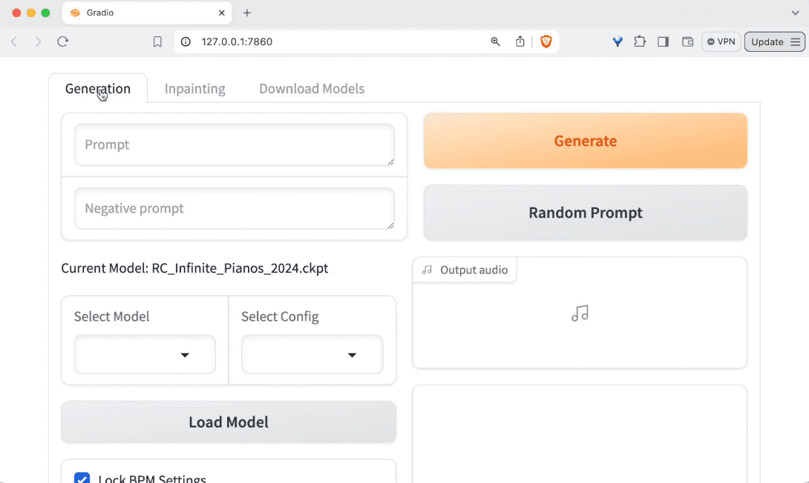

# 🎵 RC Stable Audio Tools

**Stable Audio Tools** provides training and inference tools for generative audio models from Stability AI. This repository is a fork with additional modifications to enhance functionality such as:

- **Dynamic Model Loading**: Enables dynamic model swaps of the base model and any future community finetune releases.

<p align="center">
  
</p>


- **Random Prompt Button**: A one-click Random Prompt button tied directly onto the loaded models metadata.

<p align="center">
  
</p>


- **BPM & Bar Selector**: BPM & Bar settings tied to the model's timing conditioning, which will auto-fill any prompt with the needed BPM/Bar info. You can also lock or unlock the BPM if you wish to randomize this as well with the Random Prompt button.

<p align="center">
  
</p>

- **Key Signature Locking**: Key signature is now tied to UI and can be locked or unlocked with the random prompt button.

<p align="center">
  
</p>

- **Automatic Sample to MIDI Converter**: The fork will automatically convert all generated samples to .MID format, enabling users to have an infinite source of MIDI.

<p align="center">
  
</p>

- **Automatic Sample Trimming**: The fork will automatically trim all generated samples to the exact length desired for easier importing into DAWs.

<p align="center">
  
</p>

- **Model-Specific Prompt Builders**: Supported models can expose their own prompt-building controls and vocabularies. Random Prompt generation is synchronized with the builder controls so generated ideas can be adjusted manually afterward.

- **One-Shot Generation**: A dedicated One Shot mode is available for generating individual sounds and samples. One Shot generation works best with models trained for one-shot support.

- **Keybed Generation & Export**: Generate pitch-consistent keybeds across a playable range and export completed instruments to **DecentSampler** or **SFZ**. *Instrument Generation must be used with models trained for keybed support.*

- **Layered Keybeds**: Build multi-layer instruments from up to three generated keybeds, with independent layer controls and shared global effects.

- **Batch Generation**: Generate multiple loops or one-shots in a single run while using the same shared model runtime and prompt-building workflow as the main Generation interface.

## 🚀 Installation

### 📥 Clone the Repository

First, clone the repository to your local machine:

```bash
git clone https://github.com/RoyalCities/RC-stable-audio-tools.git
cd RC-stable-audio-tools
```

### 🔧 Setup the Environment

#### 🌐 Create a Virtual Environment

It's recommended to use a virtual environment to manage dependencies:

- **Windows:**

  ```bash
  python -m venv venv
  venv\Scripts\activate
  ```

- **macOS and Linux:**

  ```bash
  python3 -m venv venv
  source venv/bin/activate
  ```

#### 📦 Install the Required Packages

This fork is currently tested with **Python 3.10**. The required runtime dependencies are defined and pinned in this repository's `setup.py`.

```bash
python -m pip install --upgrade pip
pip install .
```

### 🪟 Additional Step for Windows Users

To ensure Gradio uses GPU/CUDA and not default to CPU, uninstall and reinstall `torch`, `torchvision`, and `torchaudio` with the correct CUDA version:

```bash
pip uninstall -y torch torchvision torchaudio
pip install torch==2.5.1 torchvision==0.20.1 torchaudio==2.5.1 --index-url https://download.pytorch.org/whl/cu121
```

### 🧪 Optional (Windows / Linux): INT4 / Low-VRAM Mode (TorchAO)

This fork supports **optional** INT4 weight-only inference via TorchAO.  
It can reduce VRAM usage further, but it can be **very slow on Windows** because Triton fast-kernels are usually unavailable (falls back to slower paths). 

To enable the INT4 toggle in the UI:

**Windows (recommended, pinned):**
```bash
pip install torchao==0.12.0
```

**Linux:**
```bash
pip install torchao
```

⚠️ On Linux, using the unpinned version may require some tweaking depending on your CUDA, PyTorch, and driver versions. 

If TorchAO isn’t installed or compatible with your environment, the INT4 toggle will remain hidden/disabled.

## ⚙️ Configuration

A sample `config.json` is included in the root directory. Customize it to specify directories for custom models and outputs (.wav and .mid files will be stored here):

```json
{
    "model_directory": "models",
    "output_directory": "generations"
}
```

## 🖥️ Usage

### 🎚️ Running the Gradio Interface

Start the Gradio interface using a batch file or directly from the command line:

#### Batch file example

```batch
@echo off
cd /d path-to-your-venv/Scripts
call activate
cd /d path-to-your-stable-audio-tools
python run_gradio.py --model-config models/path-to-config/example_config.json --ckpt-path models/path-to-config/example.ckpt
pause
```

#### Basic command line example

You can launch the web UI by simply calling:

```bash
python run_gradio.py
```

This will start the gradio UI. If you're running for the first time, it will launch a model downloader interface, where you can initialize the app by downloading your first model. After downloading, you will need to restart the app to get the full UI.

When you run the app AFTER downloading a model, the full UI will launch.


#### Custom command line example

You can also launch the app with custom flags:

```bash
python run_gradio.py --model-config models/path-to-config/example_config.json --ckpt-path models/path-to-config/example.ckpt
```

### 🎶 Generating Audio and MIDI

Input prompts in the Gradio interface to generate audio and MIDI files, which will be saved as specified in `config.json`.

The interface includes Bar/BPM conditioning, MIDI display + conversion, Dynamic Model Loading, model-specific prompt builders, One Shot generation, Keybed generation/export, Layered Keybeds, and Batch Generation.

Models must be stored inside their own sub folder along with their accompanying config files. i.e. A single finetune could have multiple checkpoints. All related checkpoints could go inside of the same "model1" subfolder but its important their associated config file is included within the same folder as the checkpoint itself.

To switch models simply pick the model you want to load using the drop down and pick "Load Model". 

### 🤗 Downloading models from HuggingFace



When you launch with `python run_gradio.py`, it will:

1. First check if the `models` folder contains a downloaded model.
2. If a model is available, it will launch the full UI with a checkpoint loaded.
3. If the models folder is empty, it will launch the Hugging Face model downloader, where you can select from the preset models or enter a Hugging Face repo ID manually. After downloading a model, restart the app to launch the full UI.
4. To customize the preset models shown in the downloader dropdown, edit the `config.json` file and add entries to the `hffs[0].options` array.

The downloader keeps the files needed to run the model, such as checkpoints, configuration files, README files, and licenses, while avoiding unnecessary repository assets.

## 🛠️ Advanced Usage

For detailed instructions on training and inference commands, flags, and additional options, refer to the main GitHub documentation:
[Stable Audio Tools Detailed Usage](https://github.com/Stability-AI/stable-audio-tools)

---

~~I did my best to make sure the code is OS agnostic but I've only been able to test this with Windows / NVIDIA. Hopefully it works for other operating systems.~~ The project now fully supports macOS and Apple Silicon (M1 and above). Special thanks to [@cocktailpeanut](https://github.com/cocktailpeanut) for their help!

If theres any other features or tooling that you may want let me know on here or by contacting me on [Twitter](https://x.com/RoyalCities). I'm just a hobbyist but if it can be done I'll see what I can do.

Have fun!
